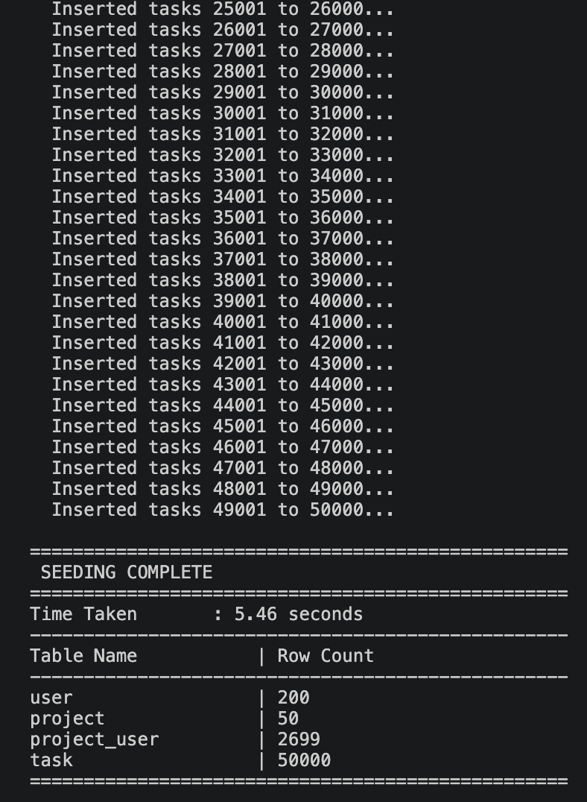
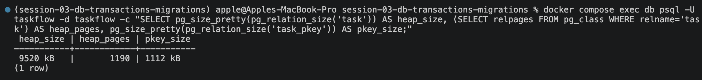
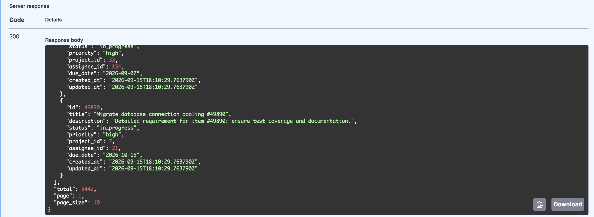
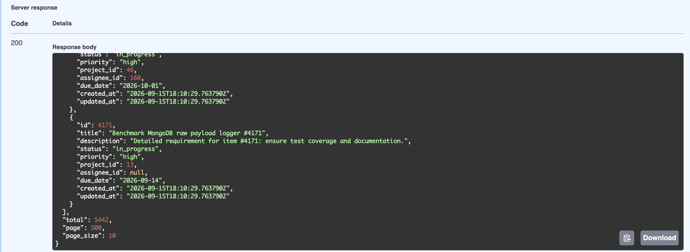
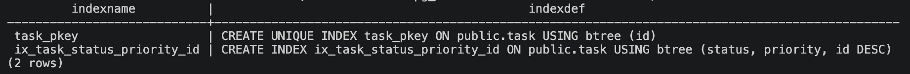

# Index + EXPLAIN ANALYZE Before/After

## Loom Video

TODO: add Loom recording link.

## Objective

Measure a real TaskFlow filtering query before and after adding an index, and document the impact and trade offs.

## Scenario

`GET /api/v1/tasks` accepts `status`, `priority`, `project_id`, `assignee_id`, `page`, `page_size`. For every request, `TaskRepository.get_all()` runs two queries:

1. `COUNT(*)` — fills `total` in the response.
2. The page query — `ORDER BY id DESC LIMIT page_size OFFSET (page - 1) * page_size`.

Before this demo, `task` had only `task_pkey` (on `id`); the filter columns were unindexed.

**Target choice.**

- **`COUNT(*)` — primary.** It cannot stop early, so it reads every row on every request.

## Commands

```bash
docker compose down -v                      # wipe containers + DB volume
docker compose up -d                        # fresh DB; entrypoint applies all migrations
docker compose exec -T db psql -U taskflow -d postgres -c "CREATE DATABASE taskflow_test OWNER taskflow;"
uv run alembic downgrade -1                 # remove the index
make seed-huge                              # 50,000 tasks
docker compose exec -T db psql -U taskflow -d taskflow -c "ANALYZE task;"
# BEFORE: EXPLAIN ANALYZE queries below
uv run alembic upgrade head                 # add the index
docker compose exec -T db psql -U taskflow -d taskflow -c "VACUUM ANALYZE task;"
# AFTER: EXPLAIN ANALYZE queries below
```
- Each query ran 4 times; run 1 (cache-cold) was discarded and the **median of runs 2–4** is reported.

## Dataset

```text
Time Taken       : 5.46 seconds
Table Name           | Row Count
user                 | 200
project              | 50
project_user         | 2699
task                 | 50000
```

## Index

Declared in `app/models/task.py`, created by migration `f7715786b494`:

```text
 task_pkey                  | CREATE UNIQUE INDEX task_pkey ON public.task USING btree (id)
 ix_task_status_priority_id | CREATE INDEX ix_task_status_priority_id ON public.task USING btree (status, priority, id DESC)
```

Reversible (`downgrade -1` / `upgrade head`); `uv run alembic check` reports no pending changes.

## Primary Target — `COUNT(*)`

**Before** — runs: 101.751 (cold) / 48.286 / 6.154 / 4.502 ms → median **6.154 ms**

```text
 Aggregate  (cost=1953.66..1953.67 rows=1 width=8) (actual time=4.465..4.466 rows=1 loops=1)
   ->  Seq Scan on task  (cost=0.00..1940.00 rows=5465 width=0) (actual time=0.041..4.199 rows=5442 loops=1)
         Filter: ((status = 'in_progress'::task_status) AND (priority = 'high'::task_priority))
         Rows Removed by Filter: 44558
 Planning Time: 0.131 ms
 Execution Time: 4.502 ms
```

**After** — runs: 2.203 (first) / 2.173 / 2.334 / 1.330 ms → median **2.173 ms**

```text
 Aggregate  (cost=211.99..212.00 rows=1 width=8) (actual time=1.282..1.282 rows=1 loops=1)
   ->  Index Only Scan using ix_task_status_priority_id on task  (cost=0.29..198.25 rows=5498 width=0) (actual time=0.190..0.799 rows=5442 loops=1)
         Index Cond: ((status = 'in_progress'::task_status) AND (priority = 'high'::task_priority))
         Heap Fetches: 0
 Planning Time: 0.119 ms
 Execution Time: 1.330 ms
```

| Metric                 |      Before      |      After      |       Change       |
| ---------------------- | :--------------: | :-------------: | :----------------: |
| Scan                   |     Seq Scan     | Index Only Scan |         —          |
| Rows matched           |      5,442       |      5,442      |        same        |
| Rows removed by filter |      44,558      |       none      |     eliminated     |
| Warm median            |     6.154 ms     |     2.173 ms    | **−64.7% (2.83×)** |

The `Filter` became an `Index Cond`: instead of reading 50,000 rows and discarding 44,558, PostgreSQL counts the matching index entries directly.

## Secondary Target — Deep Page (`page=500`)

```sql
SELECT task.id, task.title, task.description, task.status, task.priority,
       task.due_date, task.project_id, task.assignee_id, task.created_at, task.updated_at
FROM task
WHERE task.status = 'in_progress' AND task.priority = 'high'
ORDER BY task.id DESC LIMIT 10 OFFSET 4990;
```

**Before** — runs: 29.365 (cold) / 25.636 / 11.134 / 34.118 ms → median **25.636 ms**

```text
 Limit  (cost=2291.74..2291.77 rows=10 width=159) (actual time=10.837..10.840 rows=10 loops=1)
   ->  Sort  (cost=2279.27..2292.93 rows=5465 width=159) (actual time=10.290..10.689 rows=5000 loops=1)
         Sort Key: id DESC
         Sort Method: quicksort  Memory: 1596kB
         ->  Seq Scan on task  (cost=0.00..1940.00 rows=5465 width=159) (actual time=0.032..7.938 rows=5442 loops=1)
               Filter: ((status = 'in_progress'::task_status) AND (priority = 'high'::task_priority))
               Rows Removed by Filter: 44558
 Planning Time: 0.355 ms
 Execution Time: 11.134 ms
```

**After** — runs: 40.358 (cold) / 10.092 / 5.821 / 9.818 ms → median **9.818 ms**

```text
 Limit  (cost=1771.14..1771.17 rows=10 width=159) (actual time=5.563..5.565 rows=10 loops=1)
   ->  Sort  (cost=1758.67..1772.41 rows=5498 width=159) (actual time=4.995..5.311 rows=5000 loops=1)
         Sort Key: id DESC
         Sort Method: quicksort  Memory: 1596kB
         ->  Bitmap Heap Scan on task  (cost=144.64..1417.11 rows=5498 width=159) (actual time=0.611..2.029 rows=5442 loops=1)
               Recheck Cond: ((status = 'in_progress'::task_status) AND (priority = 'high'::task_priority))
               Heap Blocks: exact=1175
               ->  Bitmap Index Scan on ix_task_status_priority_id  (cost=0.00..143.27 rows=5498 width=0) (actual time=0.500..0.500 rows=5442 loops=1)
                     Index Cond: ((status = 'in_progress'::task_status) AND (priority = 'high'::task_priority))
 Planning Time: 0.088 ms
 Execution Time: 5.821 ms
```

| Metric                 |      Before      |              After              |      Change     |
| ---------------------- | :--------------: | :-----------------------------: | :-------------: |
| Scan                   |     Seq Scan     | Bitmap Index + Bitmap Heap Scan |        —        |
| Rows removed by filter |      44,558      |               none              |    eliminated   |
| Table pages visited    |    all 1,190     |              1,175              | almost the same |
| Warm median            |    25.636 ms     |             9.818 ms            |    **−61.7%**   |

## Trade-offs

**Storage**

| Metric                                       |    Value |
| -------------------------------------------- | -------: |
| New index                                    | 1,552 kB |
| `task` table                                 | 9,520 kB |
| Index as % of table                          |   16.30% |
| Total `task` relation (table + both indexes) |    12 MB |

**Write cost** — `make seed-huge`, deterministic seed (identical 50,000 rows each run):

| Case          | Runs                 |   Mean |
| ------------- | -------------------- | -----: |
| Without index | 5.05 / 4.88 / 4.97 s | 4.97 s |
| With index    | 5.08 / 4.96 / 4.70 s | 4.91 s |

**Not measurable here.** The 0.05 s difference is smaller and the fastest run was **with** the index. The cost is real in principle — every `INSERT`/`DELETE` also updates the index, `status`/`priority` updates must maintain it

**Verdict:** 16.3% extra storage and an unmeasurably small write cost, in exchange for a faster `COUNT(*)` that runs on every task-list request — a good trade for this read-heavy endpoint.

## Findings

1. **`COUNT(*)`**: Seq Scan → Index Only Scan, `Heap Fetches: 0`, cost −89.1%, ~2.8× faster.
2. **Deep page**: 61.7% faster from avoided filtering;
3. **Query Performance SLO** (measurable improvement on 10,000+ rows via `EXPLAIN ANALYZE`): **satisfied** — 50,000 rows, both target queries improved.

## Screenshots











## Takeaways

- Measure the SQL the ORM actually generates before choosing an index.
- Run each query several times — single runs are occupied by cold caching.
- The execution plan is the evidence; a hypothesis can be wrong.

## Limitations / Follow-ups

- Timings come from local Docker on macOS — not production latency.
- Index Only Scan benefit can shrink as writes change pages.
- Results are specific to this dataset and its 10.88% selectivity.
