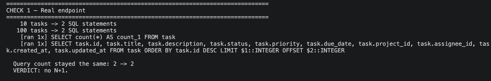
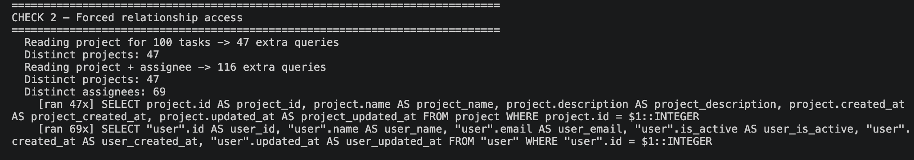
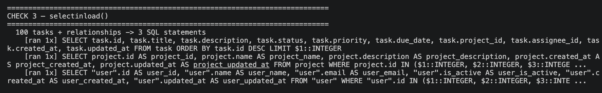
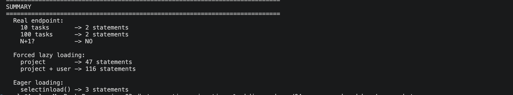

# ORM Query Breakdown — Generated SQL, Query Counts, and N+1 Analysis

## Loom Video

TODO: add Loom recording link.

## Objective

Take one meaningful ORM query in TaskFlow and establish, from measurement rather than
assumption:

1. The exact SQL SQLAlchemy generates for it.
2. The actual number of SQL statements executed per operation.
3. Whether SQLAlchemy's lazy relationship loading produces N+1 behaviour on that path.
4. Whether any optimization is justified — and if so, before/after query-count evidence.

The rule set for this exercise was deliberately strict: **optimize only if the evidence
shows a real issue**, and do not broadly refactor the ORM layer. This document reports what
was measured, including the outcome that no optimization was warranted.

---

## Query Selected

`GET /api/v1/tasks` — the paginated task list. It is the highest traffic read path in the
application and the one that fans out most: `page_size` is capped at 100, so if any
relationship were dereferenced per row, the effect would be clearly visible.

**Application path:**

```text
GET /api/v1/tasks
  → app/api/v1/endpoints/tasks.py:31        list_tasks()
  → app/services/task_service.py:71         TaskService.list_tasks()
  → app/repositories/task_repository.py:37  TaskRepository.get_all()
  → app/services/task_service.py:90         TaskResponse.model_validate() per row
```

**The two ORM operations** (`app/repositories/task_repository.py:61` and `:63`):

```python
# 1. COUNT — fills the `total` field of the response envelope
total = await db.scalar(select(func.count()).select_from(Task).where(*filters)) or 0

# 2. Paginated Task query — fills `items`
tasks = (await db.scalars(
    select(Task).where(*filters).order_by(Task.id.desc())
    .offset((page - 1) * page_size).limit(page_size)
)).all()
```

**Relationships available on `Task`** (`app/models/task.py:55-56`):

| Relationship | Target | Cardinality |
| --- | --- | --- |
| `Task.project` | `Project` | many-to-one, not nullable |
| `Task.assignee` | `User \| None` | many-to-one, nullable |

**Neither is used by this endpoint.** `TaskResponse` (`app/schemas/task.py:78-79`) exposes
`project_id: int` and `assignee_id: int | None` — the foreign-key **scalar columns that are
already part of the `task` row** — not nested `project` / `assignee` objects. With
`from_attributes=True`, `model_validate` reads only column attributes, so the relationship
descriptors are never touched.

A serialized item from the measured run confirms the response shape:

```json
{"id":50000,"title":"Refactor rate limiting middleware #50000","description":"Detailed requirement for item #50000: ensure test coverage and documentation.","status":"done","priority":"low","project_id":40,"assignee_id":10,"due_date":"2026-10-08","created_at":"2026-09-15T18:54:16.443365Z","updated_at":"2026-09-15T18:54:16.443365Z"}
```

---

## Method

Statements were counted with a SQLAlchemy `before_cursor_execute` listener, which fires just
before each statement is sent to PostgreSQL. The listener only appends the SQL text to a list
and returns nothing, so it cannot alter or intercept the query — it counts, it does not
interfere.

Each check calls `TaskService.list_tasks` directly — the same function the endpoint awaits —
through a session configured like `app/db/session.py` (`autoflush=False`,
`expire_on_commit=False`), and opens a **fresh session** first. That matters: a session caches
every object it has already loaded, so reusing one across checks would let a later check reuse
an earlier one's data and report a falsely low count. Every real HTTP request starts with an
empty cache, so every check does too.

**Dataset** — the existing seeded database (`make seed-huge`), reachable at
`postgresql+asyncpg://…@localhost:5433/taskflow`:

```text
user         |    200
project      |     50
project_user |  2,699
task         | 50,000
```

The instrumentation is not part of the application. It lives in a standalone script,
[`scripts/check_n_plus_one.py`](../../scripts/check_n_plus_one.py), which imports the
application's own service and repository rather than re-implementing their queries — so what
it measures is the endpoint's real code path. **No instrumentation was added under `app/`,
and no application code was changed for this demo.**

---

## Reproducing This Evidence

### 1. Seed a dataset large enough for the pattern to show

```bash
make seed-huge    # 50,000 tasks / 200 users / 50 projects
```

Use this exact dataset to reproduce the numbers in this document.

### 2. Run the check

```bash
uv run python scripts/check_n_plus_one.py
```

### 3. Read the output

The script runs three checks and prints a summary at the end:

| Check | What it runs | Expected result |
| --- | --- | --- |
| **1 — the real endpoint** | `TaskService.list_tasks()` at 10 rows, then at 100 rows | **2 statements both times** — the count does not grow, so there is no N+1 |
| **2 — forced probe** | the same 100 tasks, with `task.project` / `task.assignee` read on purpose | **47**, then **116** statements — one query per distinct related row |
| **3 — `selectinload()`** | the same 100 tasks loaded eagerly | **3** statements — one batched `IN (...)` query per relationship |

Check 1 is the actual N+1 test, and the script prints its own verdict by comparing the two
counts. Checks 2 and 3 deliberately run code that does **not** exist in the application, so
the contrast appears in the same output.

### What a real N+1 would look like here

Checks 1 and 2 are the side-by-side answer to the question this demo asks:

```text
CHECK 1   what the endpoint actually does      100 task rows  ->    2 SQL statements
CHECK 2   if the relationships were read       100 task rows  ->  116 SQL statements
```

Same page of tasks, same database. The only difference is whether anything reads
`task.project` and `task.assignee`. That is the whole N+1 problem in one comparison: it is
caused by *reading a relationship per row*, not by the list query itself.

---

## Baseline Generated SQL

```sql
SELECT count(*) AS count_1 FROM task
```

```sql
SELECT task.id, task.title, task.description, task.status, task.priority,
       task.due_date, task.project_id, task.assignee_id, task.created_at, task.updated_at
FROM task
ORDER BY task.id DESC
LIMIT $1::INTEGER OFFSET $2::INTEGER
```

Both statements are single-table. There is **no `JOIN`**, and **no relationship-loading
follow-up query** in the normal endpoint path — no `WHERE project.id = …`, no
`WHERE user.id IN (…)`. The SQL that reaches PostgreSQL touches only the `task` table.

---

## Query-Count Evidence

| Scenario | Task rows returned | SQL statements |
| --- | ---: | ---: |
| `list_tasks(page=1, page_size=10)` | 10 | **2** |
| `list_tasks(page=1, page_size=100)` | 100 | **2** |
| `list_tasks(status=in_progress, priority=high, page_size=100)` | 100 | **2** |
| `list_tasks(project_id=31, page_size=100)` | 100 | **2** |
| `list_tasks(page=500, page_size=100)` — deep page | 100 | **2** |

**The statement count stays constant as the number of returned rows increases.** Ten rows
cost 2 statements; one hundred rows cost 2 statements. A 10× increase in result size
produced zero additional SQL. Applying filters and paging deep into the result set did not
change the count either.

**Therefore the normal endpoint is not N+1.**

The two statements are two *different* queries serving two different fields of the response
envelope:

1. `COUNT(*)` → the `total` field.
2. `SELECT … LIMIT … OFFSET …` → the `items` field.

They are not one query repeated once per row. The presence of more than one SQL statement
is not by itself evidence of N+1; the defining characteristic — statement count growing
with row count — is absent here. **This is a fixed 1 + 1, and it is not called N+1 in this
document.**

---

## Lazy-Loading Investigation

Both relationships run on SQLAlchemy's default `lazy="select"` — a search for `lazy`,
`selectinload`, `joinedload`, `contains_eager` across `app/`
returns nothing, so no loader option is configured anywhere in the application. That default
is not a problem on its own; it only costs a query when something reads the relationship
attribute.

### Current application behaviour

- The relationships `Task.project` and `Task.assignee` are **never dereferenced** on this
  path, because `TaskResponse` consumes the FK scalar columns instead.
- **No relationship SQL is generated** — 0 relationship queries in every baseline scenario.
- **No N+1 exists** on this endpoint.

### Controlled counterfactual probe

To characterise what lazy loading *would* cost if a relationship were read, relationship
access was **deliberately forced** on the same 100-row page. These numbers describe the
probe, not the endpoint.

| Forced probe (100 task rows) | Relationship SELECTs |
| --- | ---: |
| Access `task.project` only | **47** |
| Access `task.project` and `task.assignee` | **116** (47 project + 69 user) |
| Access `task.project`, 100 tasks all from **one** project | **1** |

The page contained 47 distinct `project_id` values and 69 distinct `assignee_id` values
(16 rows had a NULL assignee), and the query counts match those cardinalities exactly.

This reveals a detail worth stating precisely: the cost here is **`1 + distinct(FK)`, not
`1 + N`**.

**These probe results are a demonstration of the potential lazy-loading problem, not
evidence that the endpoint currently has that problem.** They required code that does not
exist in the application in order to produce them.

---

## Before / After Optimization

**Optimization not applied: empirical evidence showed no ORM query-count problem in the
selected endpoint.**

There is no before/after application change to report, and none is invented here. The
endpoint already executes the minimum number of statements its response contract requires:
one `COUNT(*)` for `total`, one `SELECT` for `items`.

---

## ORM Efficiency SLO

> **ORM Efficiency SLO** — a task list query with related project/assignee data should avoid
> unnecessary repeated queries.

**Status: satisfied, by construction rather than by remediation.**

The endpoint avoids unnecessary repeated relationship queries because it returns foreign-key
scalars (`project_id`, `assignee_id`) that are already present on the `task` row, and never
dereferences the `Project` or `User` relationships. The measured relationship query count is
**0**, and the total statement count is **constant at 2** across result sizes from 10 to 100
rows, across filtered queries, and at page 500.

---

## Evidence Summary

**Current endpoint — `GET /api/v1/tasks`**

| Metric | Value |
| --- | --- |
| Task rows returned | 10 / 100 |
| SQL statements | **2** (constant) |
| N+1 | **No** |
| Relationship queries | **0** |
| Optimization applied | **No** |

**Lazy scenario — probe only**

| Metric | Value |
| --- | --- |
| Relationship access | Yes (deliberately forced) |
| Repeated queries | Yes — 47 project, 69 user, for 100 rows |
| Optimization demonstrated | `selectinload` (3 statements) |
| Application changed | **No** |

---

## Screenshots

Captured from a local run of `scripts/check_n_plus_one.py` against the `make seed-huge`
dataset.

**Check 1 — the real endpoint.** 10 rows and 100 rows both cost 2 statements, and both are
plain `task` queries. The count does not grow with the row count, so there is no N+1.



**Check 2 — forced relationship access.** Reading `task.project` costs 47 queries, and adding
`task.assignee` brings the total to 116 — matching the 47 distinct projects and 69 distinct
assignees on the page.

The screenshot shows `[ran 47x]` and `[ran 69x]` against a single statement that looks up
**one row at a time**: `WHERE project.id = $1`. The `$1` is a placeholder — SQLAlchemy sends
the SQL text once and the actual id alongside it, so the statement never changes, only the
id does. That is precisely an N+1: the same query fired again for every related row.



**Check 3 — `selectinload()`.** The same 100 tasks with both relationships, in 3 statements.
Rather than asking for one project at a time, SQLAlchemy gathers all 47 project ids and
fetches them in a single query — `WHERE project.id IN (...)`, one placeholder per id — then
does the same for the 69 users. Identical data, with 116 round trips collapsed into 2.



**Summary.** Every headline number in one frame.



---

## What We Learned

- More than one SQL statement is not N+1. The test is whether the count grows with the row
  count, and here it does not.
- The response schema, not the model, determined the query behaviour. Returning FK scalars
  is what kept relationship loading out of the picture entirely.
- When lazy loading does occur for a many-to-one relationship, the cost is bounded by the
  number of *distinct* related rows, not by the number of result rows — the identity map
  absorbs the repeats.
