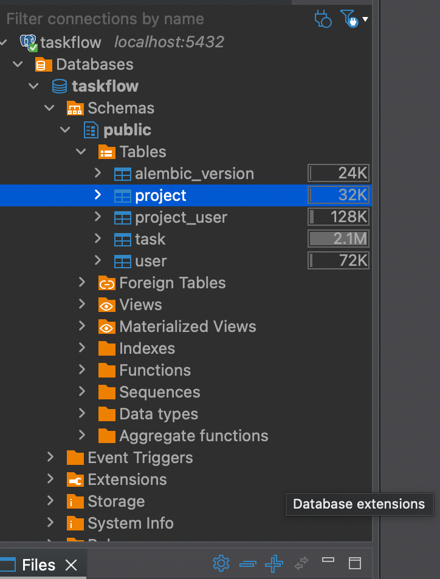
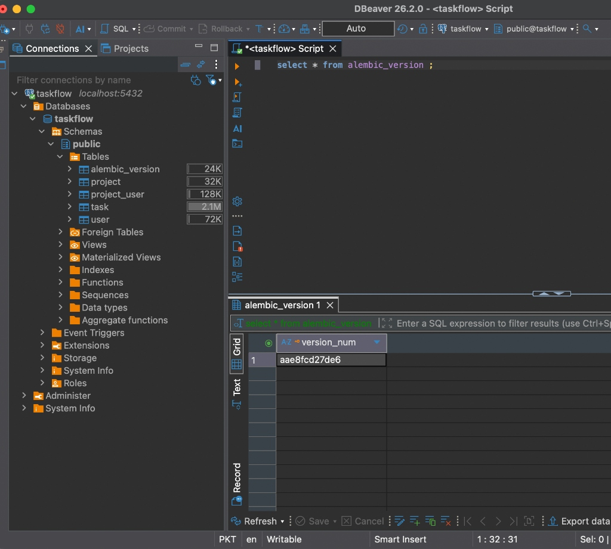
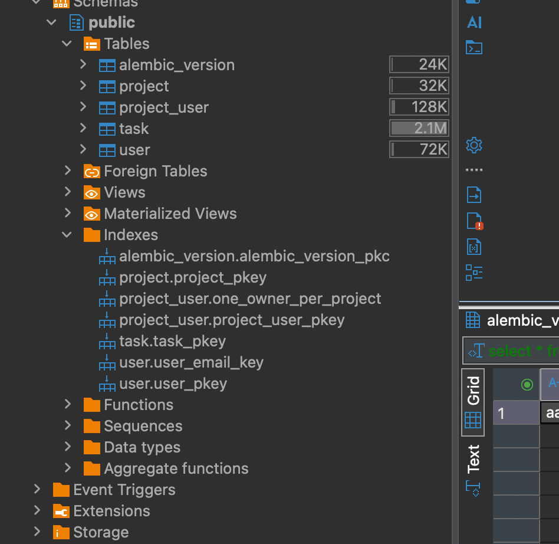
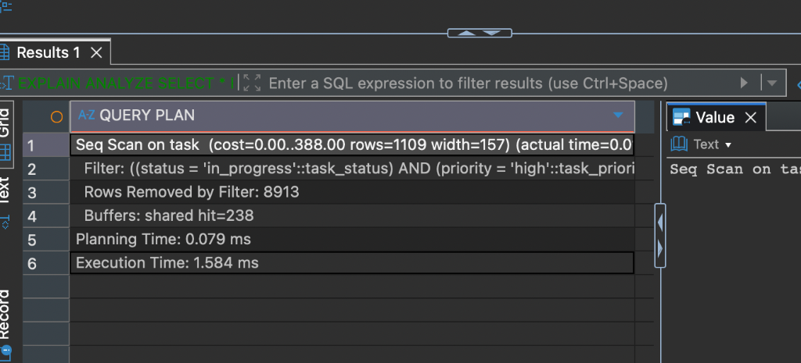

# Database IDE Inspection & Observability Findings

## 1. Executive Summary & Objective

This document records direct PostgreSQL database inspection findings using **DBeaver 26.2.0** for the `taskflow` database in **Session 03**. 

Direct database observability validates database state, schema constraints, migration revisions, and query execution plans independently of the FastAPI application layer.

---

## 2. Database Connection & Schema Setup

- **Host / Port**: `localhost:5432`
- **Database Name**: `taskflow`
- **Database Owner / Role**: `taskflow`
- **Active Schema**: `public`

### Table Storage Overview
Direct inspection reveals the public tables along with their disk sizes and physical storage footprint:

| Table Name | Disk Size | Purpose |
| :--- | :--- | :--- |
| `alembic_version` | `24 KB` | Tracks Alembic schema migration revision state |
| `project` | `32 KB` | Project metadata table |
| `project_user` | `128 KB` | Project membership join table (User Roles) |
| `user` | `72 KB` | Application user identity table |
| `task` | `2.1 MB` | Work management tasks (10,000 benchmark rows) |



---

## 3. Migration Verification

Executing manual SQL directly inside the IDE confirms the current database schema migration version:

```sql
SELECT * FROM alembic_version;
```

### Result:
- **`version_num`**: `aae8fcd27de6`

This revision hash matches `alembic/versions/2026_07_24_1533-aae8fcd27de6_initial_schema.py`, proving that the database schema is up-to-date and in sync with the codebase.



---

## 4. Index Inspection

Direct inspection of the database index tree confirms that all primary key, unique, and partial indexes exist on the physical tables:

- **`alembic_version.alembic_version_pkc`**: Primary key constraint on `version_num`.
- **`project.project_pkey`**: Primary key index on `project.id`.
- **`project_user.project_user_pkey`**: Composite primary key on `(project_id, user_id)`.
- **`project_user.one_owner_per_project`**: Partial unique index enforcing that each project has at most one owner.
- **`task.task_pkey`**: Primary key index on `task.id`.
- **`user.user_pkey`**: Primary key index on `user.id`.
- **`user.user_email_key`**: Unique constraint index on `user.email`.



---

## 5. Manual SQL & EXPLAIN ANALYZE Execution Plan

To evaluate query performance on 10,000 tasks (`make seed-large`), we ran an `EXPLAIN ANALYZE` query filtering tasks by status and priority:

```sql
EXPLAIN ANALYZE 
SELECT * FROM task 
WHERE status = 'in_progress' AND priority = 'high';
```

### Execution Plan Breakdown:

```text
Seq Scan on task  (cost=0.00..388.00 rows=1109 width=157) (actual time=0.045..1.421 ms rows=1087 loops=1)
  Filter: ((status = 'in_progress'::task_status) AND (priority = 'high'::task_priority))
  Rows Removed by Filter: 8913
  Buffers: shared hit=238
Planning Time: 0.079 ms
Execution Time: 1.584 ms
```



---

## 6. Key Debugging & Observability Observations

These insights were captured directly from the database and would **not** be visible through HTTP API responses alone:

1. **Sequential Scan on Un-indexed Columns (`Seq Scan on task`)**:
   - The query execution plan shows a `Seq Scan on task` scanning all 238 shared buffer pages (10,000 rows) and discarding 8,913 rows in memory.
   - *Observation*: While the query runs in **1.584 ms** for 10,000 rows, execution cost will scale linearly ($O(N)$) as data grows. Adding a composite index on `(status, priority)` will convert this to an Index Scan ($O(\log N)$).

2. **Database-Enforced Business Rule via Partial Index (`one_owner_per_project`)**:
   - Direct inspection of `project_user.one_owner_per_project` confirms it is a **partial unique index** defined as:
     ```sql
     CREATE UNIQUE INDEX one_owner_per_project ON project_user (project_id) WHERE (role = 'owner');
     ```
   - *Observation*: An API error on duplicate ownership would only display a generic `400 Bad Request` or exception message. Direct DB inspection confirms PostgreSQL enforces this constraint natively at the engine level, guaranteeing data integrity even if the application code bypasses ORM validations.

3. **PostgreSQL Enum Type Casting**:
   - The execution plan explicitly shows type casting `status = 'in_progress'::task_status` and `priority = 'high'::task_priority`.
   - *Observation*: PostgreSQL uses native custom ENUM types (`task_status`, `task_priority`) rather than simple `VARCHAR` columns, enforcing strict enum value safety at the database tier.

4. **Migration History Isolation**:
   - The `alembic_version` table contains a single active row (`aae8fcd27de6`), confirming that Alembic tracks schema state cleanly without requiring application memory persistence.
